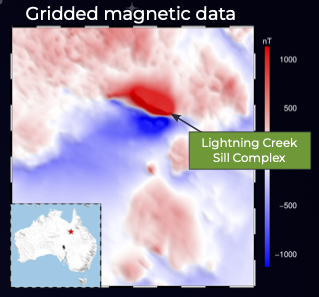

# Processing potential fields data with Fatiando a Terra

_Santiago Soler, Lu Li and Lindsey J. Heagy_

## Summary 

 The Fatiando a Terra project is a collection of open-source Python libraries for geophysics that covers a wide range of functionalities, from data download and processing to modelling and inversion. Each of the libraries in the project was designed with their own scope of applications.

  Harmonica is focused on processing and modelling gravity and magnetic data. It provides tools for gravity corrections like Bouguer and terrain effects; interpolations and upward continuation through equivalent sources; Fourier domain filters like vertical derivatives, upward continuation and reduction to the pole; forward modelling of geometries like prisms, point sources and tesseroids. Boule hosts reference ellipsoids useful for applying coordinate conversions and normal gravity calculations. Verde offers tools for processing and interpolating any type of spatial data through a diverse set of methods, with a machine learning inspired approach. Pooch eases the process of downloading and caching data from the web with a simple interface. Lastly, Ensaio offers a set of curated open-licensed datasets useful for teaching, practicing and probing our codes.

  The project started in 2010 in South America as a simple Python library as part of a PhD Thesis, and has since growth to include a global community of contributors. Its progress has been facilitated by a consistent effort of meeting the highest standards in software development. Through the adoption of best practices and a thoughtful design of its tools, the project provides well tested and well documented code that is easy to use, regardless of the Python skills of its users. This has led the project to be used in real world applications like scientific research and geophysical exploration within industry and academia.

  During this presentation we'll provide an overview of the tools in the Fatiando project, demonstrate their functionalities for processing of gravity and magnetics data, and take a look at some code snippets to showcase its capabilities and ease of use.

## Citation 

